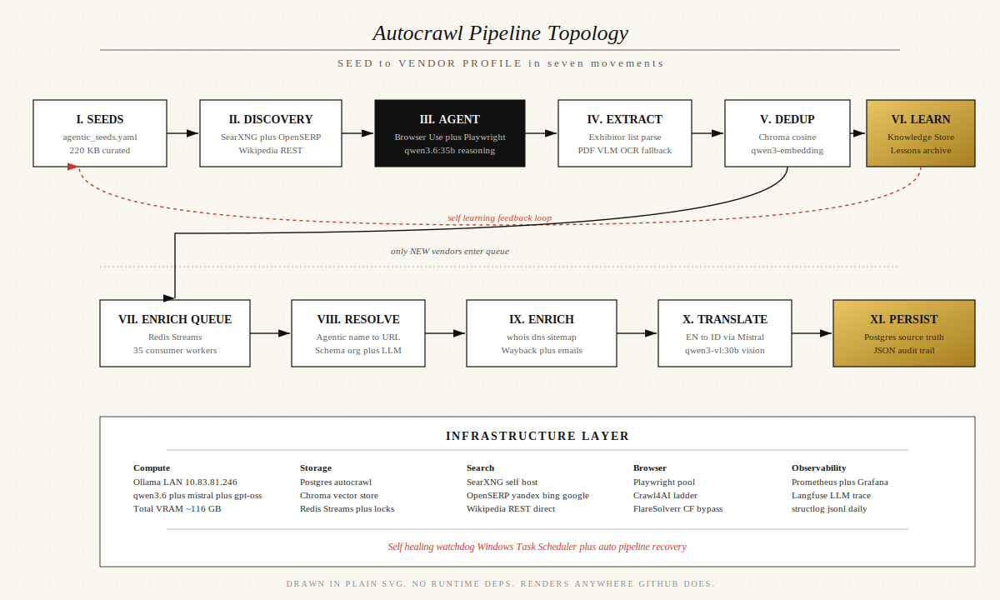

<div align="center">


# Autocrawl

**Autonomous vendor intelligence engine untuk industri security dan defense.**
Crawler 24 jam yang menemukan expo, menarik daftar exhibitor, meresolusi domain vendor asli, lalu memperkaya profil mereka dengan sumber publik gratis. Semua lokal, semua self host, zero cloud cost di jalur default.

<br />


<br /><br />

<sub>Dirakit di Indonesia. Dijaga oleh background agentic loop dan Windows watchdog.</sub>

</div>

---

## Demo Video

<div align="center">

<video src="frontend/public/ui-readme.mp4" controls width="100%" style="max-width:1100px;border:1px solid #111;">
  Browser lo tidak support tag video HTML5. Tonton versi full di
  <a href="https://drive.google.com/file/d/1T9YPZdK4NwqSC9HN3jzz_QY-Ih6QwRyx/view?usp=sharing">Google Drive</a>.
</video>

<br /><br />

<sub>720p compressed (21 MB) untuk inline GitHub README. Tonton versi 1080p original (287 MB) di <a href="https://drive.google.com/file/d/1T9YPZdK4NwqSC9HN3jzz_QY-Ih6QwRyx/view?usp=sharing">Google Drive</a>.</sub>

</div>

> **Catatan publishing.** GitHub README hanya mengizinkan tag `<video>` dengan sumber file yang di host di GitHub itself (max 100 MB). Versi `ui-readme.mp4` (21 MB hasil compress 720p crf 27) committed langsung ke repo supaya benar benar play inline. File original 287 MB di gitignore.

---

## Arsitektur Sistem

<div align="center">



</div>

> **Diagram.** File aslinya di [docs/architecture.svg](docs/architecture.svg). Plain SVG hand crafted dengan font Times New Roman, paper grain texture, gold accent untuk node Learn dan Persist, garis vermilion untuk feedback loop self learning. Tidak ada runtime dependency, render native di GitHub, Vercel, Notion, atau viewer SVG apa pun.

---

## Apa Ini Sebenarnya

Dua pipeline crawler hidup berdampingan di bawah satu brand `Autocrawl`.

| Pipeline | Lokasi | Sifat | Kapan dipakai |
|---|---|---|---|
| **Deterministic crawler** | `backend/src/crawler/` | Rules based, LangGraph state machine, scraper khusus per domain (10times, Wikipedia, generic) | Run on-demand via tombol ENGAGE atau cron. Cocok untuk situs aggregator yang struktur HTML-nya stabil. |
| **Agentic crawler** | `backend/src/agentic_crawler/` | Browser-Use Agent driven, self learning via Knowledge Store dan Lessons archive | Loop 24 jam non stop. Cocok untuk situs yang protect Cloudflare, JS-heavy, atau struktur HTML berubah ubah. |

Keduanya tulis ke Postgres yang sama. Frontend Vue 3 (palet editorial paper/ink/vermilion plus accent emas terkunci) baca dari Postgres lewat FastAPI dan render visualisasi multi halaman.

---

## Live Snapshot

> Snapshot ini diambil saat README ditulis 2026-05-18. Angka real time bisa dibaca lewat `GET /api/overview`.

<div align="center">

<table>
<tr>
<td align="center" width="25%">
  <h2 style="margin:0;color:#bf3a2a;font-family:Georgia,serif;">4091</h2>
  <sub>VENDOR TER ENRICH</sub>
</td>
<td align="center" width="25%">
  <h2 style="margin:0;color:#bf3a2a;font-family:Georgia,serif;">48</h2>
  <sub>EXPO KOLEKSI</sub>
</td>
<td align="center" width="25%">
  <h2 style="margin:0;color:#bf3a2a;font-family:Georgia,serif;">35</h2>
  <sub>WORKER ENRICH PARALEL</sub>
</td>
<td align="center" width="25%">
  <h2 style="margin:0;color:#bf3a2a;font-family:Georgia,serif;">24h</h2>
  <sub>UPTIME NON STOP</sub>
</td>
</tr>
</table>

</div>

---

## Tech Stack

<details open>
<summary><b>Backend (Python)</b></summary>

| Layer | Tools |
|---|---|
| Orchestration | LangGraph state machine plus parallel fan out |
| Browser automation | Browser Use Agent, Playwright pool, Crawl4AI ladder, FlareSolverr |
| LLM client | langchain ollama dan langchain openai, queued Chat Ollama wrapper |
| Search | SearXNG, OpenSERP multi engine, Wikipedia REST direct, DuckDuckGo, Google News RSS, Reddit, HackerNews, GitHub, arXiv, OpenAlex, Internet Archive |
| Scrapers | 10times, Wikipedia article plus extlinks, PDF VLM OCR via Ollama vision |
| Persistence | SQLAlchemy async, Postgres, Redis Streams, Chroma vector store |
| API | FastAPI dengan OpenAPI auto docs |
| Observability | structlog, Prometheus, Grafana, Langfuse |
| Translation | Mistral via Ollama untuk EN ke ID, NLLB legacy decommissioned |

</details>

<details open>
<summary><b>Frontend (TypeScript)</b></summary>

| Layer | Tools |
|---|---|
| Framework | Vue 3 dengan Composition API, TypeScript strict, Vite |
| State and data | Pinia, TanStack Query, axios |
| Styling | Tailwind CSS dengan custom paper ink vermilion design tokens, font Fraunces serif plus Geist sans plus Geist Mono plus Hanken Grotesk |
| Visualisasi | Apache ECharts, Vue Flow canvas, Leaflet, D3 geo, Lottie |
| Ikon | Lucide Vue, FontAwesome 6 |
| Live ops | noVNC client untuk Live Monitor agent browser session |

</details>

<details open>
<summary><b>LLM Cluster (Ollama remote)</b></summary>

| Model | Peran | Quant |
|---|---|---|
| `qwen3.6:35b` | Primary reasoning, agentic discovery | Q4_K_M |
| `qwen3.6:27b` | Fallback heavy | Q4_K_M |
| `mistral-small3.2:24b` | Translation EN to ID, vision capable | Q4_K_M |
| `gpt-oss:20b` | Harmony format tool calling, JSON structured | MXFP4 |
| `qwen3-embedding:8b` | Dedup vector, semantic search | Q4_K_M |
| `granite4.1:8b` | Lite fallback saat primary degraded | default |

Semua di-host di `10.83.81.246:11434` LAN. Total VRAM puncak sekitar 116 GB. Auto unload saat idle 30 menit.

</details>

---

## Quick Start

```bash
# 1. Clone dan masuk
git clone https://github.com/Y0EL/autocrawl.git
cd autocrawl

# 2. Siapkan env
cp .env.example .env

# 3. Boot stack (15 container)
docker compose up -d --build

# 4. Tail log API sampai healthy
docker compose logs -f api
```

Buka dashboard di **http://localhost:8090**.

> Default semua provider LLM diarahkan ke Ollama remote. Kalau lo mau full lokal, install Ollama di host yang sama dengan Docker dan set `LLM_BASE_URL=http://host.docker.internal:11434`. Kalau lo punya OpenAI key dan mau escape hatch cloud, set `LLM_PROVIDER=openai` plus `OPENAI_API_KEY=sk_xxx` lalu `docker compose restart crawler api`.

---

## Layanan dan URL

| Layanan | URL | Login |
|---|---|---|
| Frontend Atlas (Autocrawl admin console) | http://localhost:8090 | Tanpa login |
| FastAPI plus Swagger | http://localhost:8081/api/docs | Tanpa login |
| Grafana dashboard | http://localhost:3000 | admin admin |
| Prometheus metrics | http://localhost:9090 | Tanpa login |
| Langfuse LLM trace | http://localhost:3001 | Sign up sekali, copy keys ke `.env` |
| Postgres autocrawl | localhost:5432 | postgres 123 autocrawl |
| Redis | localhost:6379 | Tanpa login |
| Chroma | http://localhost:8000 | Tanpa login |
| FlareSolverr | http://localhost:8191 | Tanpa login |
| SearXNG | http://localhost:8088 | Tanpa login |
| OpenSERP | http://localhost:7000 | Tanpa login |
| Ollama remote | http://10.83.81.246:11434 | Tanpa login |

---

## Pipeline Deep Dive

### Deterministic Crawler

LangGraph state machine dengan 6 node utama. Setiap node punya semaphore concurrency yang auto throttle berdasarkan provider LLM.

```
discover -> worker_extract  -> worker_resolve -> worker_enrich -> finalize
        +-> worker_pdf_extract
```

Concurrency default lewat `.env`:

```env
EXPO_DISCOVERY_CONCURRENCY=10
EXHIBITOR_EXTRACTION_CONCURRENCY=15
VENDOR_RESOLUTION_CONCURRENCY=30
ENRICHMENT_CONCURRENCY=50
PDF_EXTRACTION_CONCURRENCY=4
```

Per domain rate limit 1 request per detik via Redis token bucket. Walaupun 50 worker jalan, satu domain tidak akan dipukul lebih cepat dari setting itu.

### Agentic Crawler (Self Learning Loop)

Loop 24 jam yang baca seeds, kasih ke Browser Use Agent dengan LLM reasoning, lalu belajar dari setiap success dan failure.

**Komponen utama** di `backend/src/agentic_crawler/`:

| File | Fungsi |
|---|---|
| `scheduler.py` | APScheduler 24 jam, pasang seeds prioritas knowledge plus fresh discovery |
| `runner.py` | Single seed runner. Dedup vendor via Chroma sebelum kirim ke enrich queue |
| `agent.py` | Browser Use Agent dengan custom done action, file display capture |
| `knowledge.py` | KnowledgeStore yang track successful URLs, failed domains, blacklist, recently tried query plus domain pair |
| `lessons.py` | Archive setiap run (success dan failure) untuk audit trail dan RAG context masa depan |
| `enrich_queue.py` | Redis Streams publisher untuk async vendor enrichment |
| `enrich_worker.py` | 35 paralel consumer, sekarang ada filter person name regex anti pollution |
| `preflight.py` | DNS check plus HEAD request cek vendor URL alive sebelum agent spawn |

**Self learning hooks** di `runner.py`:

```
seed_started -> agent_run -> if error:
                              -> record_failure(domain)
                              -> mark_blacklist(domain) if blocking_error
                              -> archive_lesson(status=failure)
                            -> if success:
                              -> dedup vendors via Chroma
                              -> record_success(url, new_vendors)
                              -> publish each new vendor to enrich queue
                              -> archive_lesson(status=success)
                            -> record_discovery_attempt(query, domain, outcome)
```

Setiap pass scheduler tulis ke `agentic:pass_history` Redis sorted set. Endpoint `GET /api/health/agentic` derive status `ok` / `degraded` / `down` dari sliding window 1 jam terakhir.

---

## Self Healing dan Auto Recovery

Lima lapis pengaman supaya pipeline tidak loop di tempat ketika ada anomali infra (Ollama jatuh ke CPU, domain mati, agent stuck):

<table>
<tr>
<td width="33%" valign="top">

**F1. Force release watchdog**
Kalau satu pass scheduler jalan lebih dari 90 menit, watchdog auto cancel task supaya bisa start pass baru.

</td>
<td width="33%" valign="top">

**F2. Pre flight DNS hard fail**
Seed dengan domain NXDOMAIN di drop sebelum browser_use spawn, dan di blacklist dengan reason `dns_dead`.

</td>
<td width="33%" valign="top">

**F3. LLM fallback chain**
Kalau primary `qwen3.6:35b` gagal atau VRAM 0, otomatis pakai fallback `granite4.1:8b`. Setelah 3 fail beruntun, seed masuk cooldown 30 menit.

</td>
</tr>
<tr>
<td valign="top">

**F4. Health endpoint**
`GET /api/health/agentic` derive status pipeline dari `last_successful_pass_at`, `consecutive_zero_enrich`, `llm_consecutive_failures`.

</td>
<td valign="top">

**F5. Windows watchdog**
Task Scheduler `Autocrawl Watchdog` ping `/api/health/agentic` tiap 2 menit. Auto `docker compose restart` kalau status `down` lebih dari 3 cycle.

</td>
<td valign="top">

**F6. Background cron loop**
Claude Code agent self schedule tiap 10 menit untuk health check, write iteration report ke `report/AGENT-DDMMYYYY.md`, dan auto remediate.

</td>
</tr>
</table>

---

## Struktur Repo

```
crawl/
  backend/
    src/
      crawler/                     deterministic LangGraph pipeline
        agents/                    discovery, extractor, resolver, name_resolver, enricher, reporter
        api/                       FastAPI app plus 20 plus routes
        db/                        SQLAlchemy models, repositories, idempotent migrations
        tools/
          scrapers/                10times, wikipedia, generic, pdf_extractor
          search/                  searxng, openserp, wikipedia, ddg, multi
          browsers/                httpx, playwright pool, crawl4ai ladder, flaresolverr
          parsers/                 html_parser, pdf_parser PyMuPDF plus pdfplumber plus Ollama VLM
        orchestrator/              Redis Streams event emitter
        observability/             structlog, prometheus, langfuse
        store/                     json_reporter, db_reporter, pdf_store, vector_store
      agentic_crawler/             Browser Use Agent driven loop
        agent.py                   Agent runner dengan done action plus file display
        scheduler.py               APScheduler 24h dengan knowledge plus discovery seeds
        knowledge.py               successful URLs, failed domains, blacklist persistence
        lessons.py                 audit trail per pass untuk RAG context
        enrich_queue.py            Redis Streams publisher
        enrich_worker.py           35 paralel consumer plus person name filter
        runner.py                  single seed orchestration plus dedup
        preflight.py               DNS plus HEAD check pre spawn
    tests/unit/                    pytest backend
  frontend/
    public/
      ui.mp4                       287 MB demo video (gitignored, host di Drive)
      favicon.svg                  Autocrawl mark
      globe.json                   topojson world atlas
    src/
      views/                       AtlasPage, VendorsListPage, VendorDetailPage, ExposListPage,
                                   ExpoDetailPage, OrchestratorBoardPage, LiveMonitorPage,
                                   DiagnosticsPage, ConfigurationPage, LabsPage, RunsListPage,
                                   PdfsListPage, LoginPage
      components/                  Atlas hero, GlobeBackdrop, LabsFusionResult, LiveActivityTicker,
                                   TagBadge, charts, shell layout
      composables/                 useTheme, useApiHealth, useCursorLight, useUptime, useCsvExport
      stores/                      Pinia stores
      styles/                      paper ink vermilion design tokens
  config/                          YAML seed topics dan aggregator blacklist
  data/                            JSON audit trail, PDF brosur, Chroma vector (gitignored)
  logs/                            Daily structured jsonl (gitignored)
  report/                          AGENT DDMMYYYY iteration reports
  docker-compose.yml               15 service production stack
  docker-compose.gpu.yml           Overlay opsional GPU NVIDIA
  docker-compose.gluetun.yml       Overlay opsional VPN egress
  agentic_seeds.yaml               220 KB curated seed list
  README.md                        Dokumen ini
  TUTORIAL.md                      Panduan langkah demi langkah dari nol
  DESIGN.md                        Spec design system paper ink vermilion
  PRODUCT.md                       Roadmap dan vision
  REPORT_BOTTLENECK.md             Catatan bottleneck per fase
```

---

## File Penting

| Path | Tujuan |
|---|---|
| `backend/src/agentic_crawler/agent.py` | Browser Use Agent runner, jantung pipeline 24 jam |
| `backend/src/agentic_crawler/runner.py` | Single seed orchestrator, dedup plus enrich publish |
| `backend/src/agentic_crawler/knowledge.py` | Persistent learning state |
| `backend/src/agentic_crawler/enrich_worker.py` | Async enrichment consumer dengan anti pollution filter |
| `backend/src/crawler/agents/resolver.py` | Penentu URL vendor asli, komponen paling kritikal di pipeline deterministic |
| `backend/src/crawler/agents/name_resolver.py` | Resolver vendor PDF berbasis search plus LLM |
| `backend/src/crawler/graph.py` | LangGraph state machine plus parallel fan out |
| `backend/src/crawler/api/app.py` | FastAPI factory plus lifespan plus CORS |
| `backend/src/crawler/orchestrator/events.py` | Redis Streams event emitter untuk Orchestrator board |
| `frontend/src/views/AtlasPage.vue` | Hero halaman utama Autocrawl |
| `frontend/src/views/VendorDetailPage.vue` | Profil vendor lengkap dengan source provenance |
| `frontend/src/views/OrchestratorBoardPage.vue` | Vue Flow canvas real time |
| `frontend/src/views/LiveMonitorPage.vue` | noVNC stream Browser Use session live |
| `docker-compose.yml` | 15 service production stack |
| `agentic_seeds.yaml` | 220 KB curated seed list |

---

## Perintah CLI Sering Dipakai

```bash
# Lihat status pipeline agentic real time
curl http://localhost:8090/api/health/agentic | jq

# Total vendor saat ini
docker exec autocrawl-db psql -U postgres -d autocrawl -t -c "select count(*) from vendors"

# Force restart agentic worker (kalau Ollama jatuh CPU)
docker compose restart autocrawl-agentic-a autocrawl-agentic-b

# Trigger run deterministic dari CLI
docker compose exec crawler crawl run --mode aggressive

# Health check semua dependency
docker compose exec crawler crawl health

# Test ekstraksi satu PDF tanpa run penuh
docker compose exec crawler crawl pdf-test https://expo.com/2026/exhibitors.pdf

# Reset state (clear Redis lock plus runs gantung)
docker compose exec api crawl reset-state

# Import JSON lama ke Postgres
docker compose exec api crawl db import-json

# Backfill translation EN ke ID untuk vendor lama
docker compose exec api crawl translate-vendors --limit 100
```

---

## Roadmap

**Fase 1 (sudah tercapai).** 4091 vendor ter enrich, 48 expo, dua pipeline berdampingan, self healing watchdog aktif, zero cloud cost di default jalur.

**Fase 2 (sedang berjalan).** Optimasi throughput. Iterasi 18 sampai 21 fokus pada parallel tuning, person name filter, dead seed cooldown. Target 10 vendor per menit aggregat.

**Fase 3 (rencana).** Brave Search API plus Tavily plus Hunter plus Apollo untuk enrichment quality boost. Pertimbangan switch primary LLM ke larger model kalau VRAM cluster ditambah.

---

## License

Source code di repo ini di rilis di bawah lisensi MIT kecuali ada catatan eksplisit per modul. Beberapa dependency upstream punya lisensi mereka sendiri (Crawl4AI Apache 2.0, Browser Use MIT, OpenSERP MIT, NLLB CC BY NC 4.0 jika di aktifkan kembali). Patuhi lisensi masing masing saat redistribute.

---

## Kredit dan Kontak

Dirancang, dikoding, dan dipertahankan secara solo. Arsitektur, desain, pemilihan stack, semua keputusan teknis, dan tooling otomatisasi sekitar pipeline (termasuk background cron loop yang menulis laporan iterasi setiap 10 menit di `report/AGENT-DDMMYYYY.md`) adalah hasil pemikiran satu orang ini.

Untuk pertanyaan teknis atau report bug, buka issue di GitHub repo ini.

<div align="center">
<br />
<sub>Autocrawl, 2026. Crawler yang tidak pernah tidur.</sub>
</div>
